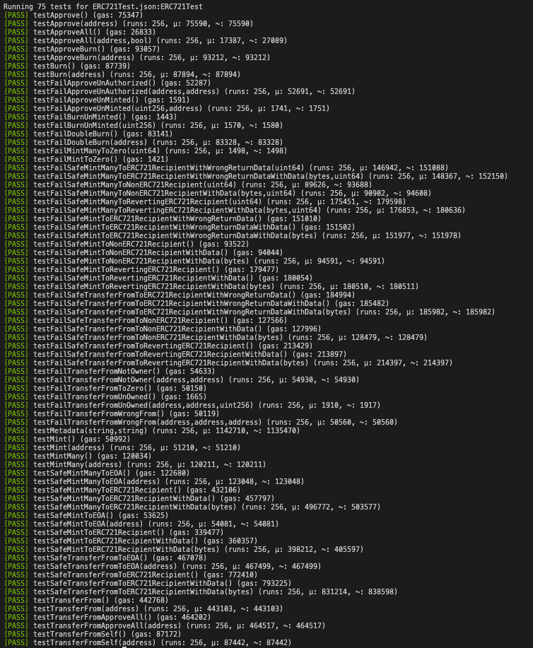

# ERC721K

ERC721K is a maximally efficient, minimalist ERC-721 implementation. Inspired by [solmate/ERC721](https://github.com/Rari-Capital/solmate/blob/main/src/tokens/ERC721.sol)'s minimalist architecture and forked from [ERC721A](https://github.com/chiru-labs/ERC721A), the contract seeks to reduce ERC721 gas costs as much as possible.

### Security

Though **this contract has not been professionally audited**, it has a strong [test suite](https://github.com/kadenzipfel/ERC721K/blob/main/src/test/ERC721K.t.sol) forked from [solmate](https://github.com/Rari-Capital/solmate/blob/main/src/test/ERC721.t.sol).

### Contributions

I intend to keep this repository active and to continually improve upon the code. If you see any possible improvement, please submit a pull request.

**DISCLAIMER: This contract has not been professionally audited. By using this contract in any way you assume all risks and liability.**
